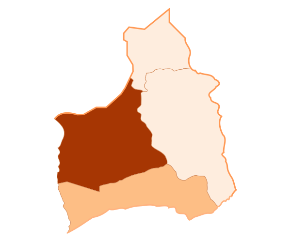

CLCHOROPLETH
============

It creates a SVG Choropleth of a Chilean region. 

Description
-----------
You need a Dictionary or a Pandas.Series with the values. The index or key can be the Comuna name and the value an int. The package uses "clcomuna" to get the comuna code, and it creates bins for the values. You can specify the comuna region, even if your data has comunas for the hole country.

Installation
------------
::

    pip3 install clchoropleth

Requirements
------------

- clcomuna
- pandas
- bf4 (BeautifulSoup)
- Python3.3+

Usage:
------

>>> import clchoropleth

Example
-------

::

    import clchoropleth
    arica = {'ARICA': 27, 'CAMARONES': 13, 'GENERAL LAGOS': 10, 'PUTRE': 8}
    data = clchoropleth.prepare_data(arica)
    clchoropleth.run(data, "arica.svg", "15")

This should save an SVG file similar to this:

**prepare_data**

``def prepare_data(data, t=70, noNone=False):``

Prepares the dataset. If its a dictionary, it turns it into a pandas.Series object. 
It checks the comuna name and uses its code instead. You can specify the threshold for the clcomuna package. 
It aggregates by comuna code, so, for exmaple, if you have ``{'arica':10, 'Arica':11, 'ARICA':12}`` it will return ``'arica':33`` as a pd.Series.
It can drops the 'None's that you will get for below the threshold.
Returns a pd.Series

::

    arica = {'ARICA': 27, 'CAMARONES': 13, 'GENERAL LAGOS': 10, 'PUTRE': 8, 'arica': 33}
    clchoropleth.prepare_data(arica)
    >>>
        15101    60
        15102    13
        15201     8
        15202    10
        dtype: int64

**select_comunas_from_region**

``def select_comunas_from_region (data, region):``

Given the dataset (after prepare_data), returns a subset with only the comunas from the given region. 'region' must be a string.

::

    data = {'ARICA': 27, 'CAMARONES': 13, 'GENERAL LAGOS': 10, 'PUTRE': 8, 'arica': 33, 'iquique': 123, 'santiago': 999}
    data_p = prepare_data(data)
    data_p
    >>>
        01101    123
        13101    999
        15101     60
        15102     13
        15201      8
        15202     10
        dtype: int64
    select_comunas_from_region(data_p, "15")
    >>>
        15101    60
        15102    13
        15201     8
        15202    10
        dtype: int64

**discretize**

``def discretize(data, bins=5, quantile=False):``

Changes the values of the data into a bin number. You can specify a number of bins to be used and if to use 'quintile' based cut or not.
::

    arica
    >>>
        15101    60
        15102    13
        15201     8
        15202    10
        dtype: int64
    discretize(arica)
    >>>
        15101    4
        15102    0
        15201    0
        15202    0
        dtype: category
        Categories (5, int64): [0 < 1 < 2 < 3 < 4]
    discretize(arica, 4, True)
    >>>
        15101    3
        15102    2
        15201    0
        15202    1
        dtype: category
        Categories (4, int64): [0 < 1 < 2 < 3]

**make_map**

``def make_map(data, filename, region, colors='orange'):``

It creates the choropleth map and saves it to filename destination.

Args:
    data: The pd.Series with the data. The index needs to be the code and the value the bin number.
    
    filename: The filename of the map we are going to save.
    
    region: we need to specify the region again, as a string ("09"), to open the original svg file and modify it.
    
    colors: it can be a string, if is one of the 5 pre-set color lists:
    orange, blue, green, red, pruple. Or it can be a list of strings, with each string being a color. For example:['#ffffcc','#c2e699','#78c679','#31a354','#006837']
    It needs to have the same length as the number of bins.
    For more colors: http://colorbrewer2.org/

Returns:
    It saves the map. No return valule.

**run**

``def run(data, filename, region, colors='orange', bins=5, quantile=False):``

Is a wrapper function that runs all the other functions of the module, except for 'preapare_data'. Doesn't return anything.
